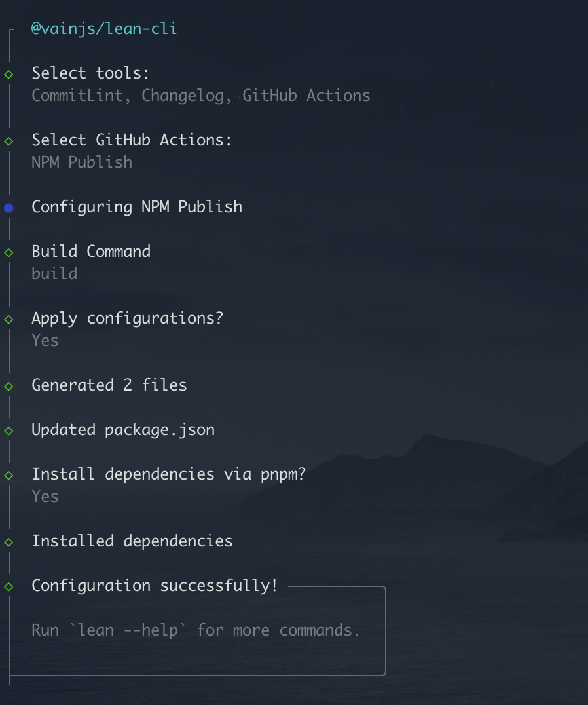

# @vainjs/lean-cli

简体中文 | [English](./README.md)

一个精简的前端开发工具，帮助您快速设置和配置必要的开发工具。

## 特性

- 交互式 CLI 配置开发工具
- ESLint 与 Prettier 集成
- CommitLint 规范化提交信息
- 自动化 changelog 生成
- GitHub Actions 工作流模板
- 支持 Monorepo

## 安装

```bash
# 全局安装
npm install -g @vainjs/lean-cli
# 或者
yarn global add @vainjs/lean-cli
# 或者
pnpm add -g @vainjs/lean-cli
```

## 使用方法

### 初始化开发配置

在项目根目录运行以下命令：

```bash
lean init
```

这将启动一个交互式提示，您可以选择要配置的工具：

- **ESLint(Prettier)**：使用 ESLint 和 Prettier 进行代码检查和格式化
- **CommitLint**：强制执行规范化的提交信息格式
- **Changelog**：基于规范化提交自动生成 changelog
- **GitHub Actions**：CI/CD 工作流模板

### 配置内容

#### ESLint + Prettier

- 安装 `@vainjs/eslint-config`、`eslint`、`prettier`、`lint-staged`
- 创建 `eslint.config.mjs` 配置文件
- 创建 `.prettierrc` 配置文件
- 使用 Husky 设置 pre-commit 钩子
- 配置 lint-staged 进行自动代码格式化

#### CommitLint

- 安装 `@commitlint/cli` 和 `@commitlint/config-conventional`
- 创建提交信息验证规则
- 使用 Husky 设置 commit-msg 钩子

#### Changelog

- 安装 `conventional-changelog-cli`
- 在 package.json 中添加 changelog 生成脚本
- 生成 changelog：`pnpm changelog`

#### GitHub Actions

- **NPM 发布**：自动化包发布工作流
- **文档部署**：文档部署工作流

### 使用示例



## 创建的配置文件

根据您的选择，可能会创建以下文件：

- `eslint.config.mjs` - ESLint 配置
- `.prettierrc` - Prettier 配置
- `.husky/pre-commit` - Pre-commit Git 钩子
- `.husky/commit-msg` - Commit 信息 Git 钩子
- `.github/workflows/*.yml` - GitHub Actions 工作流
