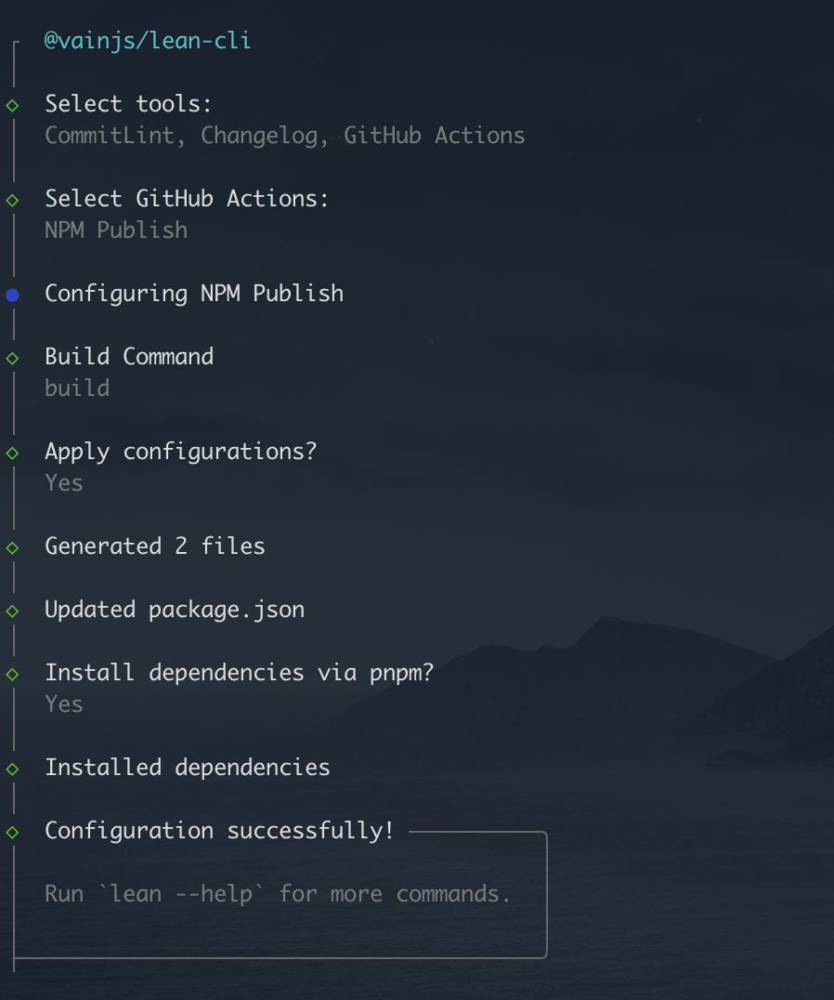

# @vainjs/lean-cli

English | [简体中文](./README-zh_CN.md)

A lean development tool for front-end projects that helps you quickly set up and configure essential development tools.

## Features

- Interactive CLI for configuring development tools
- ESLint with Prettier integration
- CommitLint for conventional commit messages
- Automated changelog generation
- GitHub Actions workflow templates
- Support for Monorepo

## Installation

```bash
# Global installation
npm install -g @vainjs/lean-cli
# or
yarn global add @vainjs/lean-cli
# or
pnpm add -g @vainjs/lean-cli
```

## Usage

### Initialize Development Configuration

Run the following command in your project root:

```bash
lean init
```

This will launch an interactive prompt where you can select the tools you want to configure:

- **ESLint(Prettier)**: Code linting and formatting with ESLint and Prettier
- **CommitLint**: Enforce conventional commit message format
- **Changelog**: Automatic changelog generation based on conventional commits
- **GitHub Actions**: CI/CD workflow templates

### What Gets Configured

#### ESLint + Prettier

- Installs `@vainjs/eslint-config`, `eslint`, `prettier`, `lint-staged`
- Creates `eslint.config.mjs` configuration file
- Creates `.prettierrc` configuration file
- Sets up pre-commit hooks with Husky
- Configures lint-staged for automatic code formatting

#### CommitLint

- Installs `@commitlint/cli` and `@commitlint/config-conventional`
- Creates commit message validation rules
- Sets up commit-msg hooks with Husky

#### Changelog

- Installs `conventional-changelog-cli`
- Adds changelog generation script to package.json
- Generate changelog with: `pnpm changelog`

#### GitHub Actions

- **NPM Publish**: Automated package publishing workflow
- **Deploy Docs**: Documentation deployment workflow

### Example Workflow



## Configuration Files Created

Depending on your selections, the following files may be created:

- `eslint.config.mjs` - ESLint configuration
- `.prettierrc` - Prettier configuration
- `.husky/pre-commit` - Pre-commit Git hook
- `.husky/commit-msg` - Commit message Git hook
- `.github/workflows/*.yml` - GitHub Actions workflows
